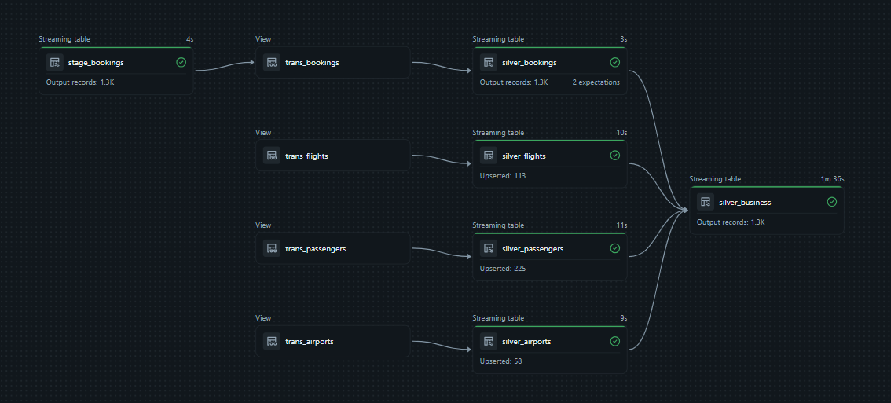

# ✈️ End-to-End Flight Booking Data Engineering Pipeline

[](https://databricks.com/)
[](https://spark.apache.org/)
[](https://delta.io/)
[](https://www.python.org/)

## 📋 Table of Contents
- [Overview](#overview)
- [Architecture](#architecture)
- [Technologies](#technologies)
- [Project Structure](#project-structure)
- [Data Pipeline Flow](#data-pipeline-flow)
- [Layer Implementation](#layer-implementation)
- [Data Model](#data-model)
- [Key Features](#key-features)
- [Setup & Deployment](#setup--deployment)
- [Use Cases](#use-cases)

---

## 🎯 Overview

This project implements a **production-ready, scalable data engineering pipeline** for processing flight booking data on Databricks. It follows the **Medallion Architecture** (Bronze → Silver → Gold) and demonstrates best practices in:

- ✅ **Incremental data ingestion** using Auto Loader
- ✅ **Streaming ETL** with Delta Live Tables (DLT)
- ✅ **Change Data Capture (CDC)** for real-time updates
- ✅ **Data quality enforcement** with automated expectations
- ✅ **Dimensional modeling** for analytics (Star Schema)
- ✅ **SCD Type 1** handling for slowly changing dimensions

### Business Problem

Airlines and travel platforms need to process millions of booking transactions, flight schedules, passenger records, and airport data in real-time. This pipeline enables:
- Real-time booking analytics
- Customer behavior insights
- Flight performance monitoring
- Revenue tracking and forecasting

---

## 🏗️ Architecture

```text
┌─────────────────────────────────────────────────────────────────────────┐
│                         MEDALLION ARCHITECTURE                          │
└─────────────────────────────────────────────────────────────────────────┘

┌──────────────┐       ┌──────────────┐       ┌──────────────┐       ┌──────────────┐
│              │       │              │       │              │       │              │
│  RAW LAYER   │──────▶│ BRONZE LAYER │──────▶│ SILVER LAYER │──────▶│  GOLD LAYER  │
│              │       │              │       │              │       │              │
│  CSV Files   │ Auto  │ Raw Delta    │  DLT  │  Cleansed    │ Star  │ Fact & Dim   │
│  in Volumes  │Loader │   Tables     │ +CDC  │   Tables     │Schema │   Tables     │
│              │       │              │       │              │       │              │
└──────────────┘       └──────────────┘       └──────────────┘       └──────────────┘
```

---

## 🔄 Data Pipeline Flow



### 1️⃣ **Raw to Bronze Layer** (Auto Loader)

